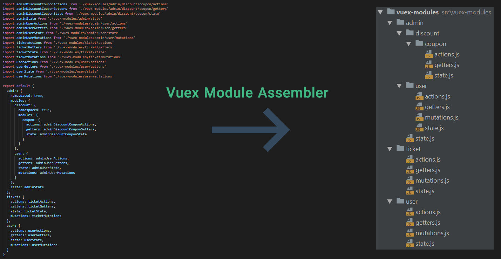

# Vue Registrar

[](http://standardjs.com)

A Vue.js package that makes your code a lot cleaner and much more understandable.

## What is this technically?
Vue Registrar is consisted of two modules that:
 * Registers all common components globally and stops need for importing them manually;
 * Assembles all your vuex modules in a nested manner.   
 
## Why should I use it?
No more words! see your self:   

### Using Component Registrar


If you're familiar with following structure, you'll need it:
```vue
// hello-world.vue
<template> ... </template>
<script>
import Something from './path/to/it'
export default {
  components: { Something }
}
</script>
```
Because using this, you just need to consider your template:
```vue
// hello-world.vue
<template> ... </template>
```

### Using Vuex Module Assembler


If you're using Vuex modules (especially in a nested or namespaced manner) like this, you'll need it:
```javascript
// store.js
import moduleAlphaState from './path/to/moduleAlpha/state'
import moduleAlphaActions from './path/to/moduleAlpha/actions'
import moduleBeta from './path/to/moduleBeta'

export default {
  a: {
    state: moduleAlphaState,
    actions: moduleAlphaActions,
    namespaced: true,
    modules: {
      nestedB: moduleBeta
    }
  }
}
</script>
```
Because using this, you don't need to do that! just follow a directory structure!
```
vuex-modules/
└── a
    ├── actions.js
    ├── state.js
    └── b
        ├── actions.js
        ├── getters.js
        ├── mutations.js
        └── state.js
```